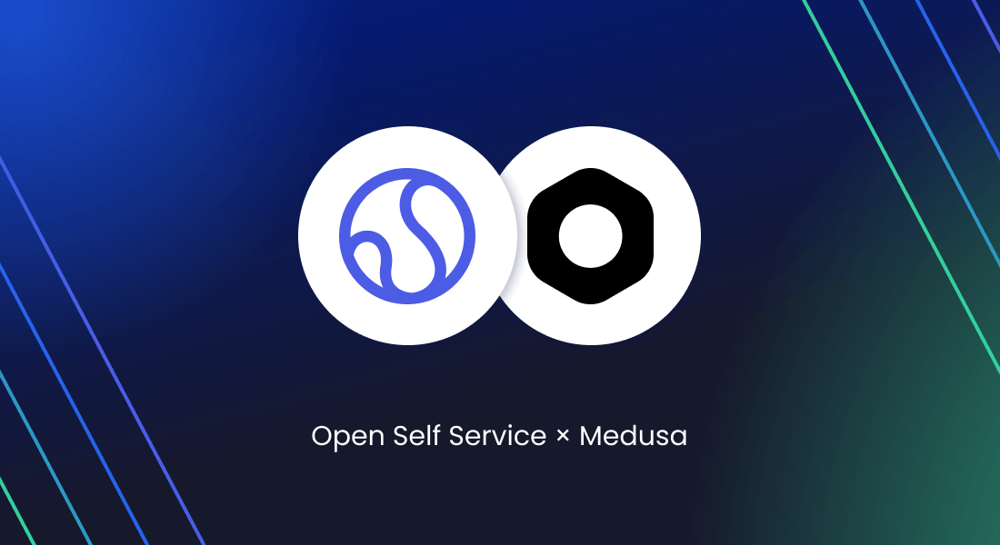

We’re excited to share the initial release of our integration between **Open Self Service** and [Medusa.js](https://medusajs.com/).

This integration allows developers to easily display commerce-related data such as **Orders**, **Assets**, and **Services** within customer-facing portals built with O2S.

<!--truncate-->

## Why integrate Medusa with O2S?

Open Self Service is not a classic storefront. It's a full-stack frontend framework for customer portals — enabling use cases like after-sales, self-service, support requests, or knowledge base apps.

Medusa, on the other hand, is an excellent choice for headless commerce logic — fast, modular, and open.

By combining both, you can:

- Extend Medusa with new capabilities for B2B and post-purchase scenarios,
- Use Medusa not only as a commerce engine but as part of broader, non-standard flows,
- Display customer orders and service data in a branded, decoupled UI,
- extend Open Self Service's frontend further so that it becomes a full-featured sales & customer support platform.

## What’s included in the integration?

We created a dedicated Medusa plugin:
[medusa-plugin-assets-services on GitHub](https://github.com/o2sdev/medusa-plugin-assets-services)

This plugin adds support for two new models:

- `Asset` - represents purchased items with serial numbers or support-relevant metadata
- `ServiceInstance` - describes purchased or assigned services for the customer

These are **fully accessible via the Medusa API** and can be queried from the frontend app using our **API Harmonization Layer**.

## What does it look like in Medusa and Open Self Service?
Once integrated, O2S provides the following out-of-the-box screens:

- **Orders page** with list, status info, and order details
  Supports sorting, pagination, and orders summary metrics.

- **Services page** presenting customer's services
  Data pulled from Medusa API (ServiceInstance model).

- **(Optional) Assets page** (currently not part of open-sourced O2S)
  Displays assigned/purchased devices / products.

In Medusa the plugin adds a few editing screens, e.g.:

[//]: # (> ![Medusa plugin UI preview]&#40;medusa-plugin-ui.png&#41;)

## Technical details

- The Medusa plugin is installed via npm and automatically adds `Asset` and `ServiceInstance` entities to your Medusa instance.
- These are exposed via REST API and can be used with any frontend (not only O2S).
- In O2S, you configure a Medusa integration module that maps the data to O2S’s normalized schema.

You can find both:

- the [plugin code here](https://github.com/o2sdev/medusa-plugin-assets-services)
- and the [O2S integration module here](https://github.com/o2sdev/openselfservice/tree/main/packages/integrations/medusajs)

## What’s next?

We’re planning to extend this integration further:
- Add **Product** APIs
- Potentially, somewhere in future add other commerce features to our frontend and extend e-commerce integration

If you're working with Medusa and looking to build **something beyond a classic shop**, we’d love your feedback.

Let us know what you'd like to see next.
And if you find it useful -> give us a ⭐ on GitHub 🙌

- [openselfservice.com](https://openselfservice.com)
- [github.com/o2sdev/openselfservice](https://github.com/o2sdev/openselfservice)
- [Demo](https://demo.openselfservice.com)

---

Got questions? Join our [Discord community](https://discord.gg/4R568nZgsT) and let’s talk.
