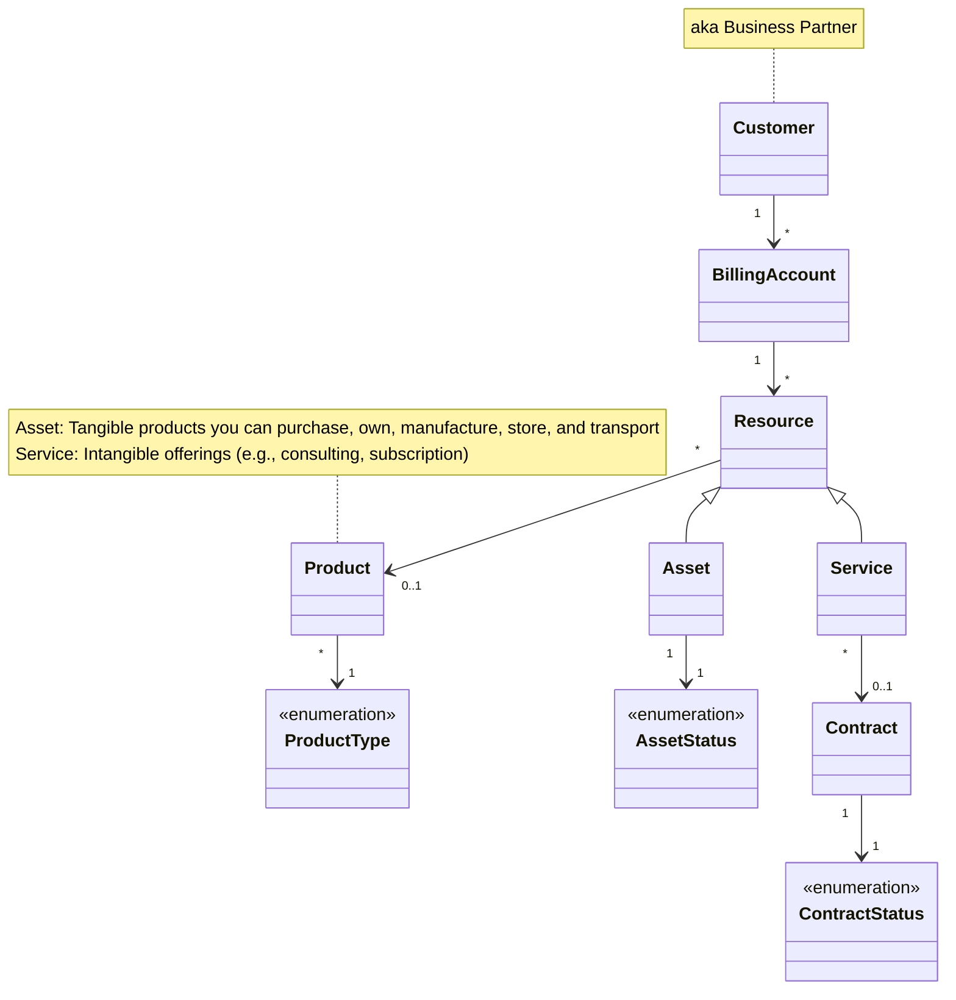

# Services

```mermaid
classDiagram

  class Customer {
  }
  note for Customer "aka Business Partner"

  class BillingAccount {
  }

  class Resource {
  }

  class Service {
  }

  class Asset {
  }

  class Product {
  }
  note for Product "Asset: Tangible products you can purchase, own, manufacture, store, and transport
  Service: Intangible offerings (e.g., consulting, subscription)"

  class ProductType {
      <<enumeration>>
  }

  class AssetStatus {
      <<enumeration>>
  }

  class Contract {
  }

  class ContractStatus {
      <<enumeration>>
  }

  %% Inheritance relationships
  Resource <|-- Service
  Resource <|-- Asset

  %% Regular relationships
  Customer "1" --> "*" BillingAccount
  BillingAccount "1" --> "*" Resource
  Resource "*" --> "0..1" Product
  Service "*" --> "0..1" Contract
  Product "*" --> "1" ProductType
  Contract "1" --> "1" ContractStatus
  Asset "1" --> "1" AssetStatus

```
