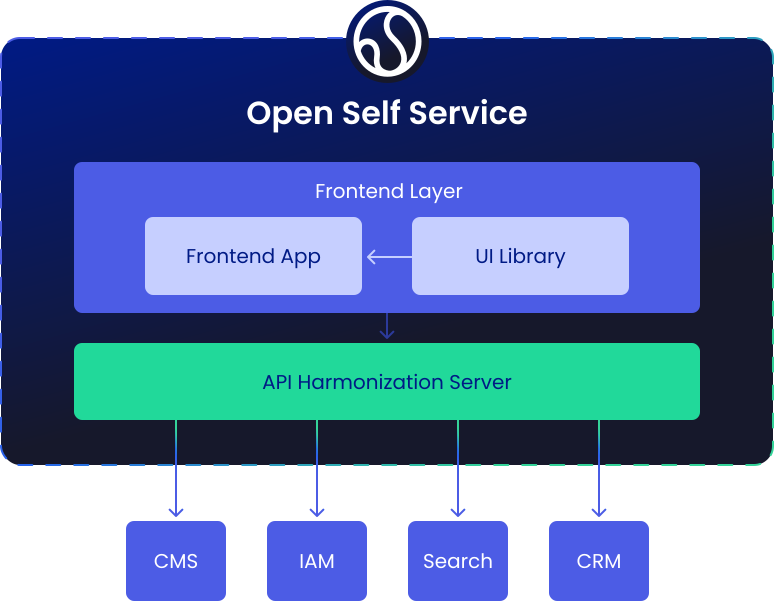
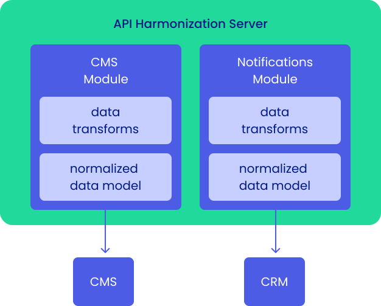
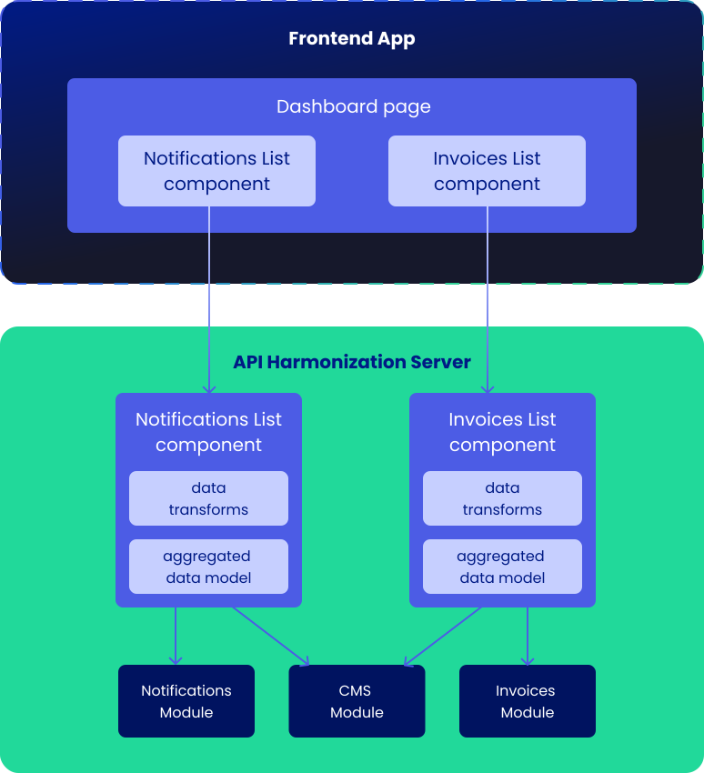

# Architecture

Open Self Service is built with modular components that work together to provide a complete framework for building composable solutions.

---

## O2S's components

The application is based on two main components:

- `o2s/frontend` - the **frontend app**, which is an application that provides the interactive UIs to the customers, composed of reusable components,
- `o2s/api-harmonization` - the **API Harmonization server**, where we fetch and aggregate the data from multiple APIs integrations to fully separate presentation layer from backend services.

Each of these applications are semi-independent, therefore they are also built and deployed separately. This also means that the API Harmonization server can be even used without the provided frontend app - using our SDK you can leverage the normalized data model in your own applications, whether they are web or mobile based, or even in other backend integrations like AI assistants or chatbots.

Both of these applications are further supplemented by several other packages:

- `@o2s/ui` - a set of reusable **UI components** library, themable and ready to be customized to your needs,
- `@o2s/framework` - a framework providing the **fundamentals** that can be used to extend the API Harmonization server and its normalized data model; it also provides an extendable **SDK** that can be used to communicate with it,
- `@o2s/integrations.*` - several ready-to-use **integrations** with other products, that you can easily plug into the API harmonization layer.

---
## Important architectural concepts

### Data normalization

In classic architectures, data used on the frontend is often directly defined by those vendors. This makes the process of replacing those data sources extremely time-consuming and complex, as it usually requires rewriting the frontend logic almost from scratch to accommodate new data formats, new APIs and generally a new way of handling business processes.

Using a headless architecture is a first step to make this operation less complex - it decouples the frontend layer from backend code, making it easier at least from the organizational side (like having independent backend/frontend deployment processes). However, it is still not enough in order to fully separate the UI from API, as changes in the data still need to be immediately reflected in the frontend code.

To solve this issue, we provide an intermediate **normalization process** that allows for a near-complete UI-API separation, which:

- defines the **normalized data model**, into which every integrated API needs to be transformed,
- provides a set of **base modules and classes** - for areas like user data, tickets or invoices - that can be then implemented or extended in new integrations,
- allows you to **transform** any data that you fetch from a vendor into a predefined API-agnostic format that for the frontend application.

---

### Data harmonization

While you can use the normalized data model directly in the frontend, it is usually not the most efficient way. Most often there is a need to further **aggregate data** from multiple differnt sources:

- either from the same integration, in cases where there is a need for more complex **orchestration**,
- of from multiple different integrations, when it's necessary to **combine** some data together, like combining static content from a CMS with dynamic user data.

To achieve this, we introduce a process called **harmonization**, which does exactly that. It's based on a set of modules that are built with a purpose to provide all necessary data (aggregated from multiple sources) for the frontend components. This makes it:

- more efficient from the performance side, as there is much less logic on the frontend/browser side - it all happens in the API Harmonization server,
- more component-based, as it's easy to create a frontend component that is tightly connected with its harmonizing component - further decoupling UI from APIs.

We provide dedicated harmonizing components for areas like

- tickets/notifications/invoices lists and details,
- payment summaries,
- navigation and footer,
- FAQs and other static content.

---

### Integrations

One of the key areas of O2S are both the privided API integrations, and a system to easily create new ones that connect to different backend services.

:::note
It's once again important to note that which integrations are actually used is transparent to the frontend app - it only communicates with API Harmonization server and never directly with deeper backend services.
:::

Each integration consists of:

- _(mandatory)_ services that handle API communication and normalize received data,
- _(optional)_ methods and endpoints that extend the ones provided out-of-the-box (in case an integration extends or otherwise modifies the base module).
